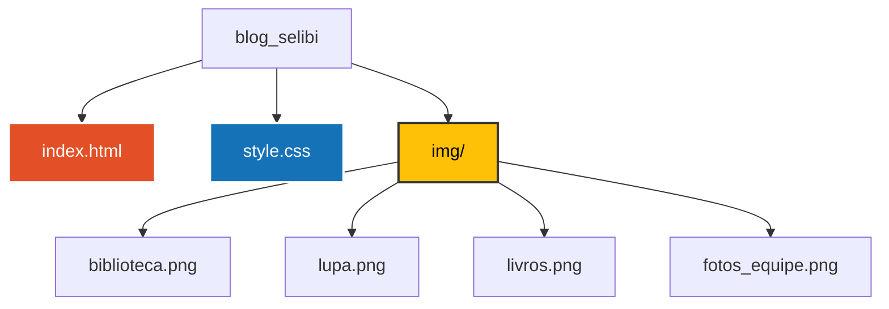

# 📚 Blog Selibi 2026 - Thalita Rebouças

> Projeto escolar (blog) de desenvolvimento front-end criado para a feira literária [Selibi 2026](https://www.sesisp.org.br/educacao/noticia/selibi-2026-incentiva-protagonismo-estudantil-e-fortalece-a-formacao-de-leitores-na-rede-sesi-sp), com foco na vida e nas obras da escritora brasileira Thalita Rebouças.

> [!NOTE]
> **🚧 Projeto em Fase Final:** O projeto está nos últimos ajustes de layout e conteúdo. **Entrega oficial do projeto: 02 de outubro de 2026**. 

## 🚀 Funcionalidades e Estrutura

*   **Perfil da Autora:** Cabeçalho fixo (`position: fixed`) com compensação de margem e hero section com plano de fundo temático.
*   **Carrossel Infinito:** Animação infinita do carrossel das capas de livros desenvolvida com CSS puro (`@keyframes` e `transform`).
*   **Linha do Tempo (Timeline):** Componente visual construído semanticamente com `<time>` e `<article>`, utilizando pseudo-elementos (`::before`) para os marcadores cronológicos da carreira da autora.
*   **Vitrine de Livros Interativa:** Layout com estante organizada por coleções (*Fala Sério!*, *Ela disse, Ele disse* e *Confissões*), com badges de destaque (🎬 *Virou Filme*, ⭐ *Best-Seller*) e sobreposição translúcida com desfoque de fundo (`backdrop-filter`) para exibir a resenha (sinopse) no hover.
*   **Cartões de Perfil da Equipe:** Exibição estruturada dos integrantes do projeto utilizando Grid Layout, divisórias estilizadas e efeitos de elevação (`:hover`) ao passar o mouse.
*   **Menu e Rolagem Suave:** Navegação por links âncora com efeito de transição suave (`scroll-behavior: smooth`).

## 📊 Status do Projeto

| Tarefa | Status |
| :--- | :---: |
| Estrutura HTML do Cabeçalho e Menu | ✅ Concluído |
| Centralização da Foto e Correção de Z-Index | ✅ Concluído |
| Lógica e Animação do Carrossel de Livros | ✅ Concluído |
| Linha do Tempo da Jornada da Autora | ✅ Concluído |
| Vitrine Interativa de Livros (Hover Overlay) | ✅ Concluído |
| Estrutura da Seção "Adaptações para o Cinema" | ⏳ Em Andamento |
| Estrutura da Seção "Livros e Coleções" | ✅ Concluído |
| Sobre o Grupo (Equipe) | ✅ Concluído |
| Desenvolvimento do Rodapé (Footer) | ✅ Concluído |
| Publicação na Internet (Hospedagem) | ⏳ Pendente |

## 🛠️ Tecnologias Utilizadas

*   **HTML5:** Semântica e estruturação.
*   **CSS3:** Flexbox, Grid Layout, animações avançadas (`@keyframes`), efeito de vidro/desfoque (`backdrop-filter`) e Media Queries para adaptação em telas menores (A questão da responsividade do blog ainda está em desenvolvimento, logo, por enquanto, não é totalmente responsivo).
*   **Git / GitHub:** Versionamento do código e colaboração escolar.

---

## 🌎 Teste o preview deste projeto no seu navegador!

> O projeto já conta com adaptações responsivas (`@media queries`) para reorganizar os cartões da equipe e o menu, e segue em aprimoramento contínuo para a versão final do projeto. 

> [!NOTE]
> **🚨 Atenção:** O preview hospedado no Netlify está em processo de atualização constante conforme avançamos para a entrega final. Logo o link abaixo ainda não está atualizado! 

- **Selibi 2026:** [VEJA O PREVIEW DESTE PROJETO NO SEU NAVEGADOR!](https://alicesilva2012.github.io/selibi/))
  
---

## 📂 Arquitetura do Projeto

